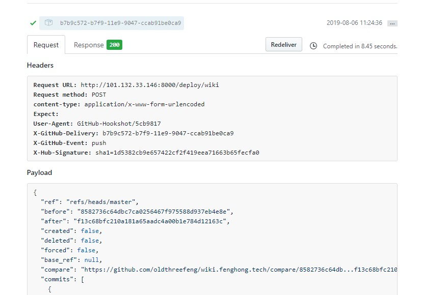
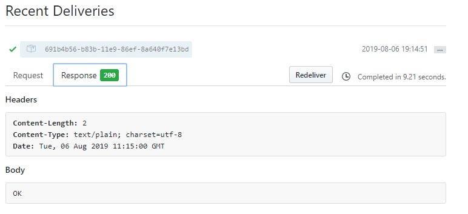

## ginuse

autoDeploy your project. 

### Webhooks干嘛用的？

> Github Webhooks提供了一堆事件，这些事件在用户特定的操作下会被触发，比如创建分支(Branch)、库被fork、项目被star、用户push了代码等等。
我们可以自己写一个服务,将服务的URL交给Webhooks，当上述事件被触发时，Webhook会向这个服务发送一个POST请求，请求中附带着该事件相关的详细描述信息(即Payload)。
这样，我们就可以在自己服务中知道Github的什么事件被触发了，事件的内容是什么？据此我们就可以干一些自己想干的事了。能干什么呢？官方说You're only limited by your imagination，就是说想干什么都行，就看你的想像力够不够 :)

> 当指定的事件发生时，我们将向您提供的每个URL发送POST请求。通过这个post请求，我们就能实现自动拉取仓库中的代码，更新到本地，最终实现自动化更新


### webHook Post



- Request URL

即前面配置中填写的"Payload URL"

- content-type

即前面配置中选择的"Content type"

- X-Hub-Signature

是对Payload计算得出的签名。当我们在前面的配置中输入了"Secret"后，Header中才会出现此项。官方文档对Secret作了详细说明

```cgo
1. 监听端口port:8000,监听的uri路径path,运行部署脚本sh,webhook的secret,
2. 使用-p 指定端口,使用-path 指定uri路径,使用-sh 指定运行脚本, 使用-s 指定密码,
3. 原理是通过webhook的Post,来校验sha1,通过校验则执行部署脚本
```

- 验证



## 普通部署

- 下载项目

```shell
$ git clone  https://github.com/oldthreefeng/ginuse.git
$ cd ginuse
```

- 编译项目

```shell
$ go build deploy.go
$ deploy -h
deploy version: deploy:1.0.5
Usage: deploy [-p port] [-path UriPath] [-sh DeployShell] [-pwd WebhookSecret]

Options:
  -h	show this help
  -p string
    	listen and serve port (default "8000")
  -path string
    	uri serve path (default "/deploy/wiki")
  -pwd string
    	deploy password (default "hongfeng")
  -sh string
    	deploy shell scritpt (default "/app/wiki.sh")
```

- 运行项目

```shell
./deploy
```

## 使用docker部署

- 下载项目

```shell
$ git clone  https://github.com/oldthreefeng/ginuse.git
$ cd ginuse
```

- 更改volume

```shell
$ vi docker-compose.yml
version: "3.0"
services:
  deploy:
    image: registry-vpc.cn-shanghai.aliyuncs.com/louisehong/deploy:1.0.9
    restart: always
    volumes:
      - "/data/logs/gin:/logs"   ## gin的访问日志
      - "/app/:/app/"            ## 主机的项目地址挂载至容器
    ports:
      - "8000:8000"

```

- 启动项目

```shell
docker-compose up -d
```

练手的go项目,学习golang15天~
